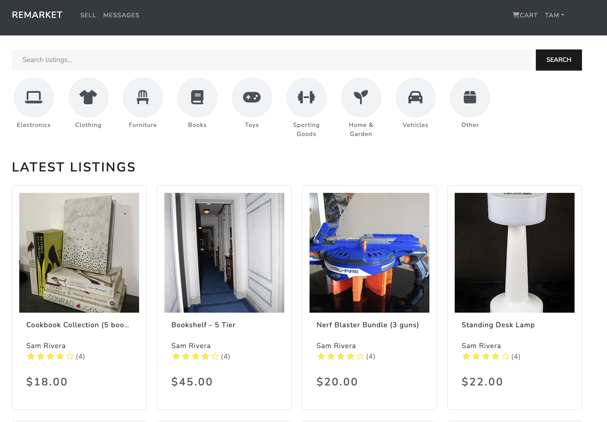
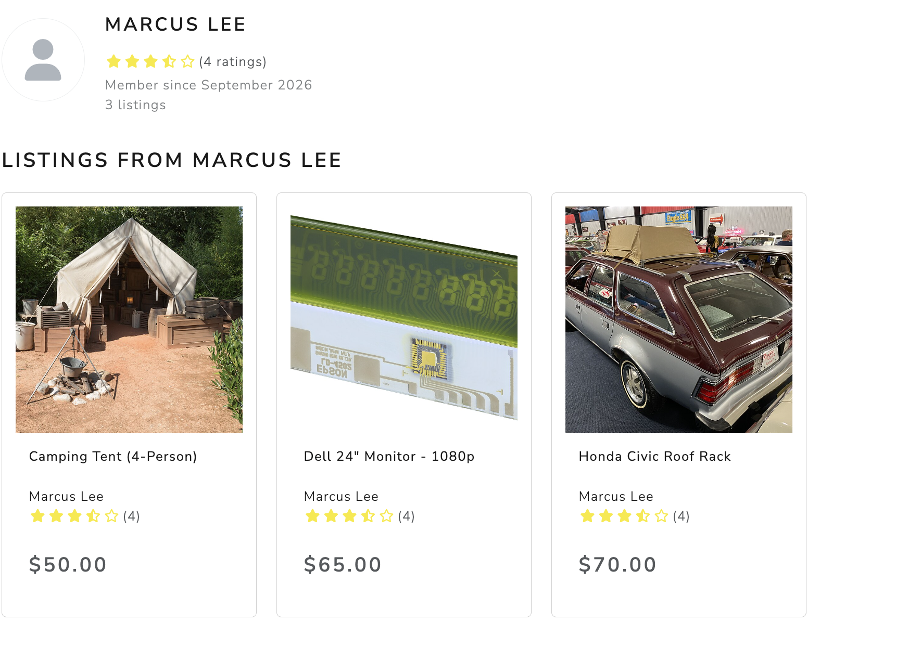
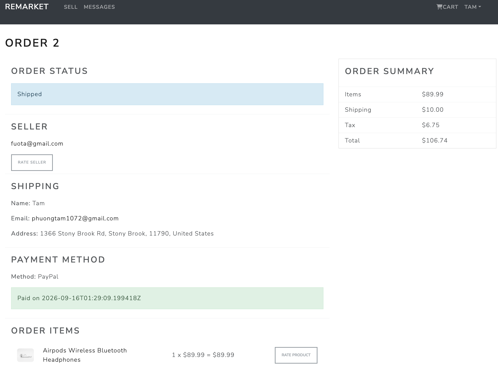
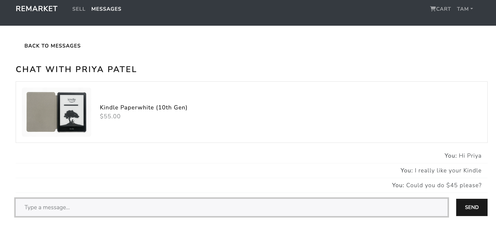

## VendorVista

A peer-to-peer marketplace for buying and selling used goods, built with
Django (REST Framework + Channels) and React (Redux). Any signed-in user can
post their own listings, browse and search what others are selling, buy
directly from another user with PayPal checkout, and chat with a seller in
real time before buying.

### Browse & search

Listings are organized by category with a keyword search on top, and the
grid loads more as you scroll.



### Seller profiles

Every seller has a public profile showing their photo, star rating, when
they joined, and everything they currently have listed.



### Order tracking, seller & product ratings

Buyers can follow an order's status end to end, jump straight to the
seller's profile, and rate the seller or the product once it's been paid for.



### Real-time chat

Buyers and sellers can message each other about a specific listing before
committing to a purchase, over a live WebSocket connection.



## Features

1. **Listings**: post an item with multiple photos and videos, condition,
   brand, color, category, and price; edit or delete anytime, including
   removing individual photos.
2. **Browse & search**: category filter, keyword search, and infinite
   scroll on the home feed.
3. **Multi-seller cart & checkout**: a cart can hold items from different
   sellers; checkout splits it into one order per seller, each paid
   individually via PayPal.
4. **Order tracking**: a clear status pipeline (Being Processed, then
   Shipped, then Delivered) for both what you bought and what you sold.
5. **Real-time chat**: WebSocket-based messaging (Django Channels) between
   buyer and seller, scoped to a specific listing.
6. **Seller profiles & ratings**: public seller pages with average rating,
   member-since date, and their active listings; buyers who've actually
   purchased from a seller can rate them.
7. **Product reviews**: rate and review an item after buying it.
8. **Accounts**: JWT-based authentication, editable profile with a profile
   picture, and a view of both your purchases and your sales.

## Tech stack

- **Backend**: Django, Django REST Framework, Django Channels (Daphne/ASGI)
  for WebSocket chat, JWT auth via `djangorestframework-simplejwt`
- **Frontend**: React, Redux, React Router, React Bootstrap
- **Payments**: PayPal JS SDK
- **Media**: Cloudinary (production), local disk (development)
- **Database**: PostgreSQL (production), SQLite (development)
- **Deployment**: Render (see `render.yaml`) + Neon Postgres

## Running locally

```bash
# Backend
python -m venv myenv && source myenv/bin/activate
pip install -r requirements.txt
cd backend
python manage.py migrate
python manage.py runserver

# Frontend, in a separate terminal
cd frontend
npm install
npm start
```

The frontend expects the backend at `http://127.0.0.1:8000` by default (see
`frontend/package.json`'s `proxy` field for local development).
